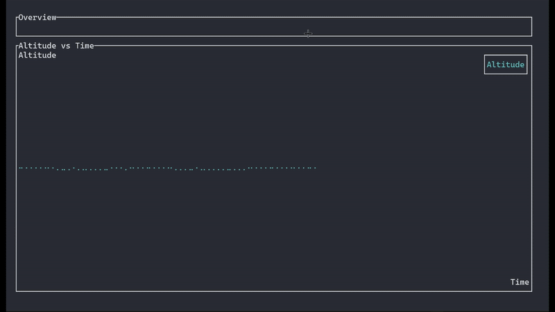

# Sentinel-TUI 🚀📡

**Sentinel-TUI** is a terminal-based telemetry dashboard for drones, built with [Ratatui](https://github.com/ratatui-org/ratatui). It features a multi-tab interface for real-time visualization of altitude, GPS coordinates, and IMU data (pitch, roll, yaw).

 <!-- optional later -->

---

## ✨ Features

- 📊 Live altitude chart (simulated)
- 🌍 GPS data simulation (lat, lon, alt)
- 🧭 IMU data simulation (pitch, roll, yaw)
- 🧪 Works in both real and simulated telemetry modes (MAVLink integration coming soon)
- 🧱 Built with `ratatui` and `crossterm`

---

## 🔧 Installation

```bash
git clone https://github.com/YOUR_USERNAME/Sentinel-TUI.git
cd Sentinel-TUI
cargo run
